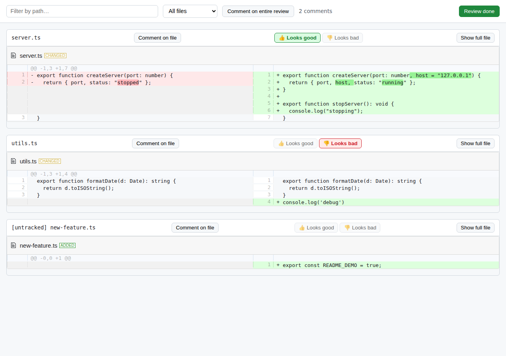

# diff-review

Review your uncommitted git changes in a browser, leave scoped comments, and
hand structured feedback back to an AI coding agent (Claude Code) — without
ever running `git diff` by hand.



## Why

When an agent makes a batch of edits, the usual way to check the result is to
commit and look at git, or scroll through a long chat reply. `diff-review`
skips that: it opens a real side-by-side diff view in your browser, lets you
comment on exactly the lines/files/overall change you care about, and hands
those comments back to the agent as structured data it can act on.

## How it works

1. The agent runs `diff-review <target> --wait` as a backgrounded command.
   This starts a short-lived local server on `127.0.0.1` and opens your
   browser — the agent isn't frozen while you review, it just gets notified
   automatically the moment you're done.
2. You review on your own time: expand context, filter files, mark files
   👍/👎, leave comments on a line, a file, or the review as a whole.
3. Click **Review done**. The server writes your comments to disk, prints
   them as [TOON](https://github.com/toon-format/spec) (a compact,
   token-efficient alternative to JSON) back to the waiting command, and
   shuts itself down.

You never have to tell the agent you're finished — clicking the button is
the only signal it needs. There's no long-lived server, no polling, no
login — just a local review loop that gets out of the way when it's not
needed.

If the agent's environment can't background commands, it can fall back to
the plain form instead: `diff-review <target>` returns immediately with a
URL, and once you say you're done, it runs `diff-review comments <target>`
to read your comments back.

## Install

Not published to npm yet, so `npx` won't work. Clone and link it locally:

```bash
git clone https://github.com/AlexxSvensson/GitDiffReviewer.git
cd GitDiffReviewer
npm install
npm run build
npm link
```

This puts a `diff-review` binary on your PATH.

## Quick start

```bash
# Open a review of everything uncommitted in the current repo, and wait for it —
# run this backgrounded so it doesn't block; you'll get the comments the moment
# "Review done" is clicked
diff-review . --wait
```

Or, without waiting:

```bash
# Open a review of everything uncommitted in the current repo
diff-review .

# ...review in the browser, click "Review done"...

# Read the comments back
diff-review comments .
```

Example output:

```
comments[3]{scope,file,line,body}:
  change,src/server.ts,42,"This retry loop has no backoff — could hammer the upstream"
  file,src/utils.ts,,"console.log left in from debugging"
  global,,,"Looks good overall, just the two notes above"
```

## Comment scopes

Comments map to exactly one of three scopes, matching how most PR review
tools already work:

| scope    | has file | has line | meaning                                 |
|----------|----------|----------|------------------------------------------|
| `change` | yes      | yes      | a comment on one specific line           |
| `file`   | yes      | no       | a comment on an entire file               |
| `global` | no       | no       | a comment on the review as a whole        |

**Click any diff row** to leave a `change` comment. **"Comment on file"** on
a file's toolbar leaves a `file` comment. **"Comment on entire review"** in
the page toolbar leaves a `global` comment.

### 👍/👎 verdict shortcuts

Each file also has one-click **Looks good** / **Looks bad** buttons — click
again to clear, click the other to switch. A verdict is just a fast way to
leave a `file`-scope comment ("Looks good"/"Looks bad") without typing; it
round-trips through the same `comments.toon` as everything else, so the
agent sees it like any other comment.

## Diff view features

- **Side-by-side rendering** (old on the left, new on the right), including
  added/deleted/renamed/binary files.
- **Two context levels** per file: the default hunk view, or "Show full
  file" to see the whole file with changes highlighted.
- **Filter by path** (substring match) and by **verdict** (all / good / bad /
  no verdict yet) — both apply together.

## Commands

| Command                         | Description                                          |
|----------------------------------|-------------------------------------------------------|
| `diff-review`                    | Home view: path, description, available commands.     |
| `diff-review <target>`           | Open a review for `<target>` (a path; defaults to `.`).|
| `diff-review comments <target>`  | Read back saved comments for `<target>` as TOON.       |
| `diff-review setup hooks`        | Install a SessionStart hook (Claude Code, Codex, OpenCode). |
| `diff-review update`             | Self-update — errors until this is published to npm.   |

`<target>` only identifies *which repo* to review (it resolves to the
enclosing git root) — the review always covers the whole repo's uncommitted
changes, not just that subdirectory.

### Flags (after `<target>`)

| Flag             | Effect                                                              |
|------------------|-----------------------------------------------------------------------|
| `--staged`       | Diff staged changes against `HEAD` instead of working tree vs. base.  |
| `--base <ref>`   | Diff against `<ref>` instead of `HEAD`.                                |
| `--no-open`      | Start the server but don't open a browser automatically.              |
| `--port <n>`     | Use a specific port instead of an OS-assigned one.                     |
| `--wait`         | Block until "Review done" is clicked, then print the comments as TOON directly instead of returning immediately. |

## Using it as a Claude Code skill

A generated `SKILL.md` lives at `.claude/skills/diff-review/`. Any Claude
Code session opened inside this repo picks it up automatically. To make it
available in *every* project, copy it to your global skills directory:

```bash
# macOS/Linux
cp -r .claude/skills/diff-review ~/.claude/skills/diff-review

# Windows (PowerShell)
Copy-Item -Recurse -Force .\.claude\skills\diff-review "$env:USERPROFILE\.claude\skills\diff-review"
```

The skill is generated from the same source as the CLI's home view
(`npm run skill:generate`), so its instructions can't drift from what the CLI
actually does. `npm run skill:check` (also run in CI) fails the build if the
committed `SKILL.md` is stale.

## Security

- The review server **only ever binds to `127.0.0.1`** — this is a hardcoded
  literal in the code, never sourced from config or a flag, so there's no
  path to accidentally exposing it on the network.
- It serves nothing beyond the review page, its JS/CSS bundle, and
  `POST /save` — and shuts itself down after a successful save or a
  15-minute idle timeout.
- Diffs are never sent anywhere external — everything stays on your machine.

## Development

```bash
npm install
npm run build   # tsc (CLI/server) + tsc --noEmit (frontend typecheck) + esbuild (frontend bundle)
npm test        # vitest — git layer, TOON round-trip, review server, frontend state logic
```

Project layout:

```
src/
  cli/        CLI commands (runAxiCli wiring, target/comments/setup-hooks)
  git/        Shells out to git: diff, file content, binary detection
  review/     Review-id hashing, on-disk store, payload assembly
  server/     The loopback HTTP server + HTML page template
  frontend/   Preact UI: diff rendering, comment forms, verdict buttons, filters
  toon/       Comment type + TOON encode/decode/validation
scripts/      SKILL.md generator
test/         Mirrors src/, one test dir per module
```

See [`docs/DESIGN.md`](docs/DESIGN.md) for the original design rationale —
why an async, no-long-poll flow was chosen, the AXI (Agent eXperience
Interface) philosophy this follows, and the security constraints that shaped
the server design.

## License

MIT
